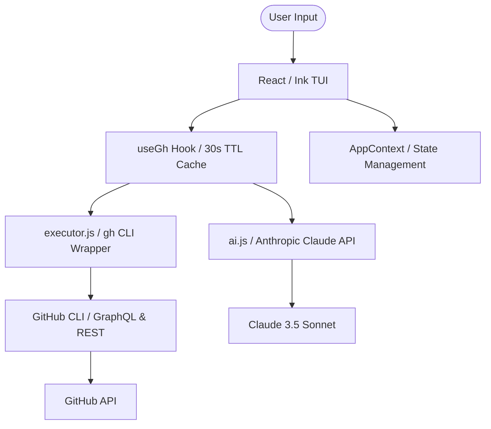

# 🦥 lazyhub

### The high-performance, keyboard-driven terminal UI for GitHub.

[](https://github.com/saketh-kowtha/lazyhub/actions/workflows/ci.yml)
[](https://www.npmjs.com/package/lazyhub)
[](https://nodejs.org)
[](https://github.com/saketh-kowtha/homebrew-tap)
[](LICENSE)

**lazyhub** is a terminal UI (TUI) that wraps the GitHub CLI (`gh`) into a cohesive, Vim-inspired experience. Inspired by the legendary `lazygit`, it surfaces Pull Requests, Issues, Actions, and Notifications in a lightning-fast interface, allowing you to manage your entire GitHub workflow without your fingers ever leaving the home row.

---

## ⚡️ Why lazyhub?

Context switching is a flow-killer. Jumping between your terminal and a browser to approve a PR or check a CI log fragments your focus. **lazyhub** brings the entire GitHub Web UI into your terminal.

- **🚀 Zero Latency:** No browser tabs, no heavy Electron apps. Just a raw, optimized TUI.
- **🧠 AI-Native Review:** Integrated with Anthropic’s Claude 3.5 Sonnet to analyze diffs and suggest fixes with a single keystroke.
- **🔍 Fuzzy Search Everything:** Filter lists, jump to files in a 5,000-line diff, or find a specific workflow run instantly.
- **🎨 Elite Theming:** Includes Tokyo Night, Catppuccin, and GitHub Dark/Light presets. Fully customizable via JSON.

---

## 🏗 Architecture

lazyhub is built on a decoupled, reactive architecture using **React** and **Ink**. It treats the `gh` CLI as its primary data engine, ensuring your local authentication and enterprise configurations just work.



---

## 🚀 Power User Features

### 🤖 AI Inline Review (`A` key)
Don't just look at code; understand it. While in the Diff View, press `A`. Claude scans your changes, identifies potential bugs or architectural smells, and lets you post those suggestions as real GitHub comments instantly.

### 🔭 Deep Diff Navigation
- **`f` (File Jump):** Fuzzy search filenames within a PR to jump directly to the relevant hunk.
- **`t` (File Tree):** Toggle a sidebar showing the directory structure of the changes.
- **`s` (Split View):** Toggle between Unified and Side-by-Side diff modes.

### 🛠 Extensible Custom Panes
Need a view for your team's specific deployments or Gists? Define a custom pane in your `config.json`.
```json
"customPanes": {
  "my-deploys": {
    "label": "Deployments",
    "icon": "🚀",
    "command": "gh api repos/{repo}/deployments"
  }
}
```

---

## 📦 Installation

### via Homebrew (Recommended)
```bash
brew install saketh-kowtha/tap/lazyhub
```

### via npm
```bash
npm install -g lazyhub
```

---

## 🎹 Keybindings (The Essentials)

| Key | Action |
| --- | --- |
| `Tab` | Cycle Navigation Panes |
| `j / k` | Navigate List / Scroll Content |
| `Enter` | View Detail / Open PR |
| `d` | Open Diff View |
| `/` | Fuzzy Search Current List |
| `A` | Trigger AI Review (in Diff) |
| `m` | Merge PR (Pick Strategy) |
| `r` | Refresh (Bypass Cache) |
| `S` | Settings & Themes |
| `?` | Full Keyboard Cheat Sheet |

---

## 🤝 Contributing

We welcome contributions from the community! Whether it's a bug fix, a new theme, or a feature request, check out our [ARCHITECTURE.md](./ARCHITECTURE.md) to understand the project's internal invariants.

```bash
# Setup for development
npm install
npm run dev   # Auto-rebuild on change
npm test      # Run Vitest suite
```

---

## 📜 License

MIT © [Saketh Kowtha](https://github.com/saketh-kowtha)

---