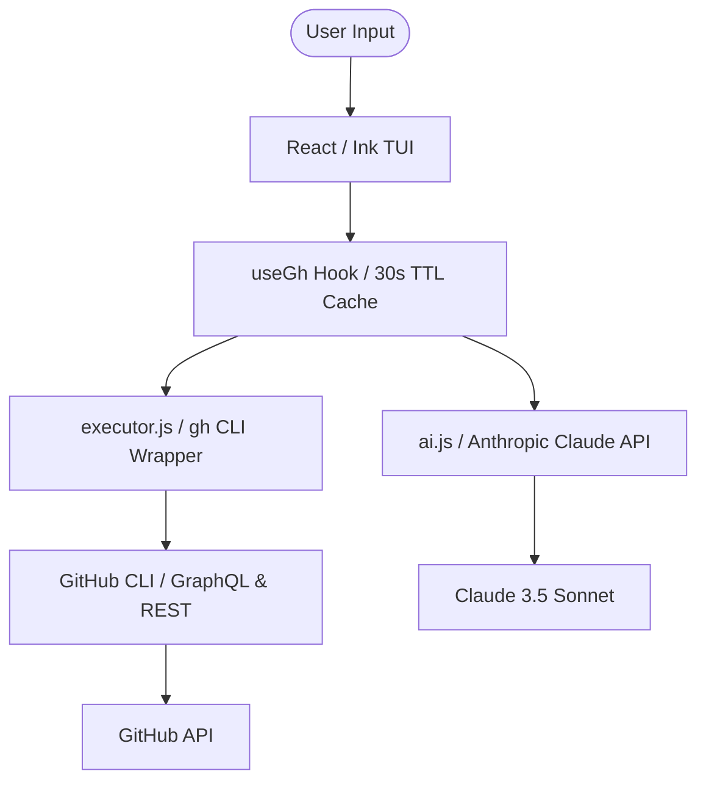

# 🦥 lazyhub

### The keyboard-driven GitHub tool for power users.

[](https://github.com/saketh-kowtha/lazyhub/actions/workflows/ci.yml)
[](https://www.npmjs.com/package/lazyhub)
[](https://nodejs.org)
[](LICENSE)
[](https://github.com/vadimdemedes/ink)

**lazyhub** is a terminal UI (TUI) that wraps the GitHub CLI (`gh`) into a cohesive, keyboard-driven experience. Inspired by the legendary `lazygit`, it allows you to manage PRs, Issues, Actions, and Notifications without ever switching to your browser.

---

## ⚡️ Why lazyhub?

Context switching is the enemy of flow. If you live in a terminal but find yourself clicking through the GitHub Web UI to review code, check CI logs, or triage issues, **lazyhub** is for you.

- **Zero Context Switching:** Review PRs, reply to comments, and merge code while your editor stays open.
- **AI-Powered Code Review:** Integrated with Anthropic's Claude to analyze diffs and suggest improvements with a single keystroke.
- **High-Performance Navigation:** Fuzzy search every list, jump to files in diffs, and navigate via Vim-style bindings.
- **Responsive Layout:** Automatically scales from a minimal single-column list to a full 3-pane dashboard.

---

## 🏗 Architecture

lazyhub is built on a robust, decoupled architecture designed for speed and reliability. It uses a single-source-of-truth pattern where all GitHub interactions flow through a specialized executor.



---

## 🚀 Features

### 🧠 AI Inline Review (`A` key)
Don't just look at code; understand it. Press `A` in the diff view to have Claude analyze the changes. It identifies bugs, performance bottlenecks, and style issues, allowing you to post AI suggestions as real GitHub comments instantly.

### 🔍 Fuzzy Everything
Stop scrolling. Press `/` in any list (PRs, Issues, Branches) to filter instantly. In the diff view, press `f` to fuzzy-jump directly to any file in the PR.

### 🛠 Custom Panes
Extend lazyhub with your own data. Add custom panes to your `config.json` backed by any `gh api` command or local script. Use JS pre-processors to transform raw JSON into beautifully rendered TUI rows.

### 🎨 Theming System
Choose from 6 built-in themes (GitHub Dark/Light, Catppuccin, Tokyo Night) or create your own with a simple JSON override file.

---

## 📦 Installation

### via npm (Recommended)
```bash
npm install -g lazyhub
```

### via Homebrew
```bash
brew install saketh-kowtha/tap/lazyhub
```

---

## 🎹 Keybindings (The Essentials)

| Key | Action |
| --- | --- |
| `Tab` | Cycle Panes |
| `j / k` | Navigate List |
| `Enter` | View Detail |
| `d` | Open Diff View |
| `a` | Approve PR |
| `m` | Merge PR (Pick Strategy) |
| `A` | Trigger AI Review (in Diff) |
| `/` | Fuzzy Search |
| `S` | Settings & Themes |
| `?` | Help Overlay |

---

## 🛠 Configuration

On first launch, lazyhub creates `~/.config/lazyhub/config.json`. 

```json
{
  "theme": "tokyo-night",
  "mouse": false,
  "anthropicApiKey": "sk-ant-...",
  "pr": {
    "defaultFilter": "open",
    "pageSize": 100
  }
}
```

---

## 🤝 Contributing

We love PRs! lazyhub is built with **Node.js**, **React**, and **Ink**. Check out [ARCHITECTURE.md](./ARCHITECTURE.md) for a deep dive into the codebase before you start.

```bash
npm install
npm run dev   # Rebuilds on save
npm test      # Vitest suite
```

---

## 📜 License

MIT © [Saketh Kowtha](https://github.com/saketh-kowtha)

---